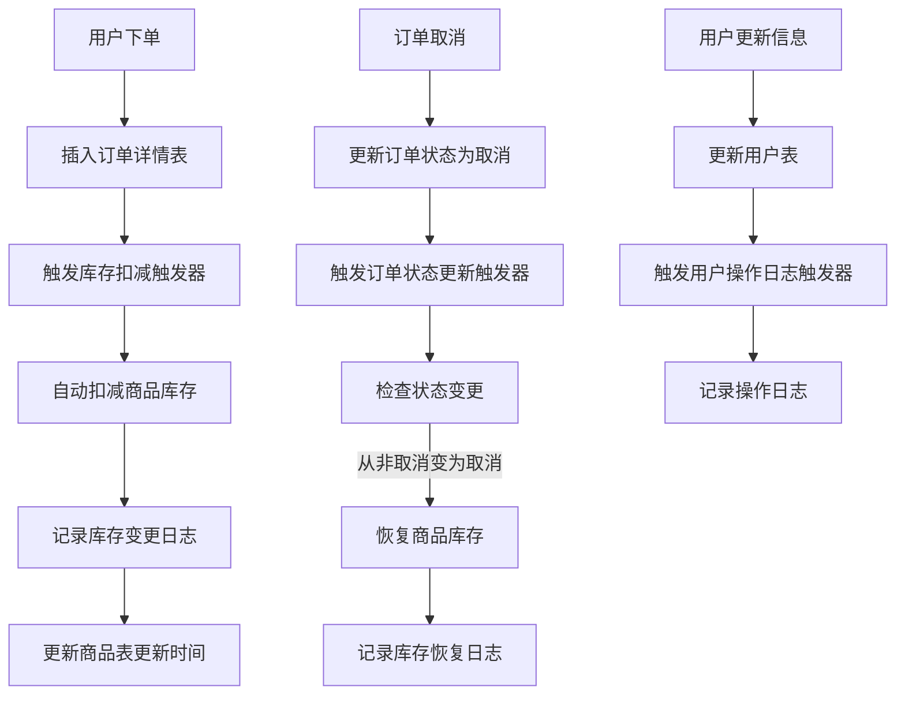
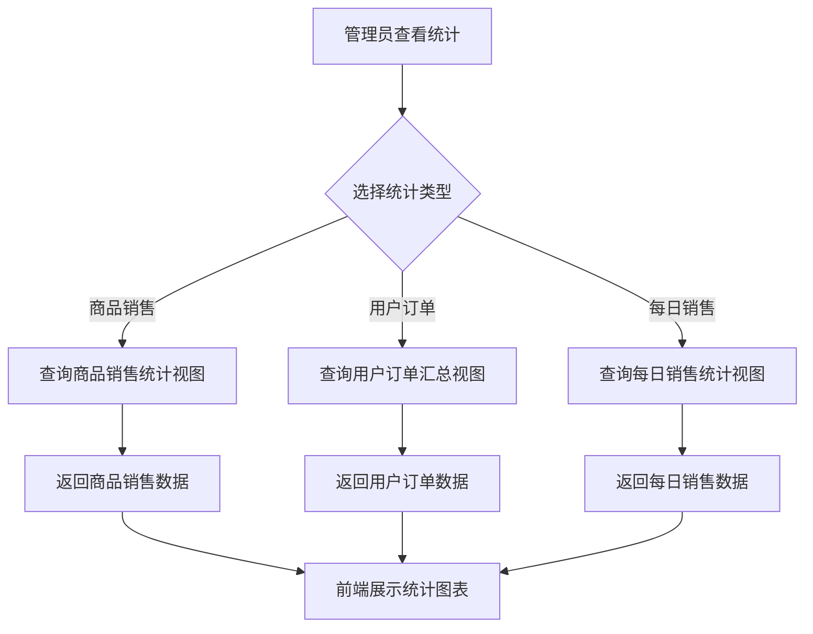
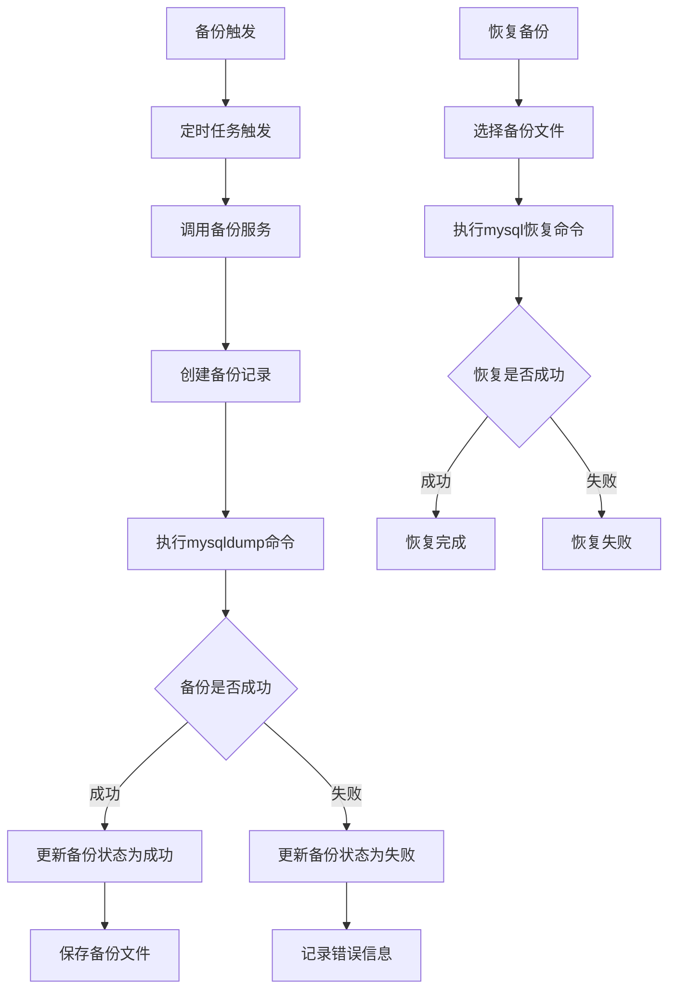
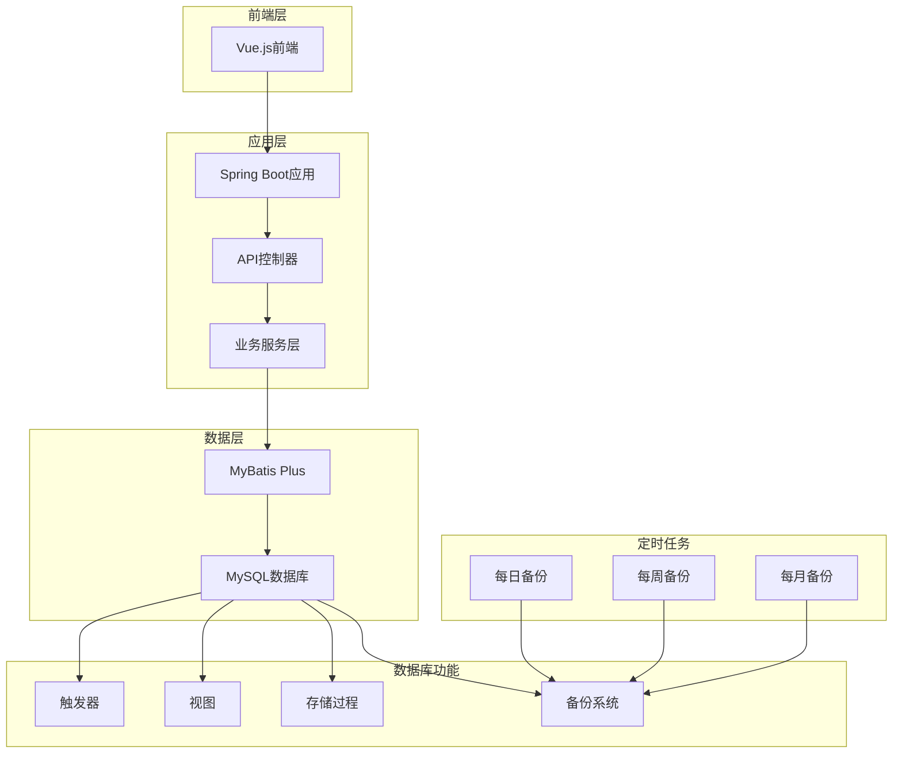
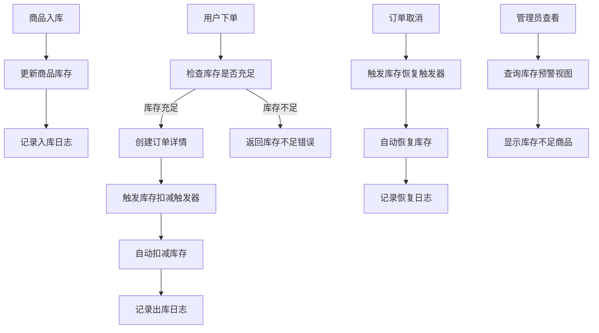
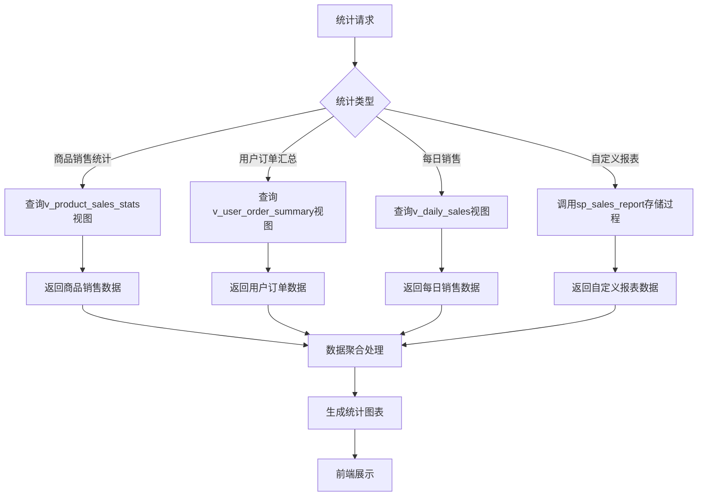
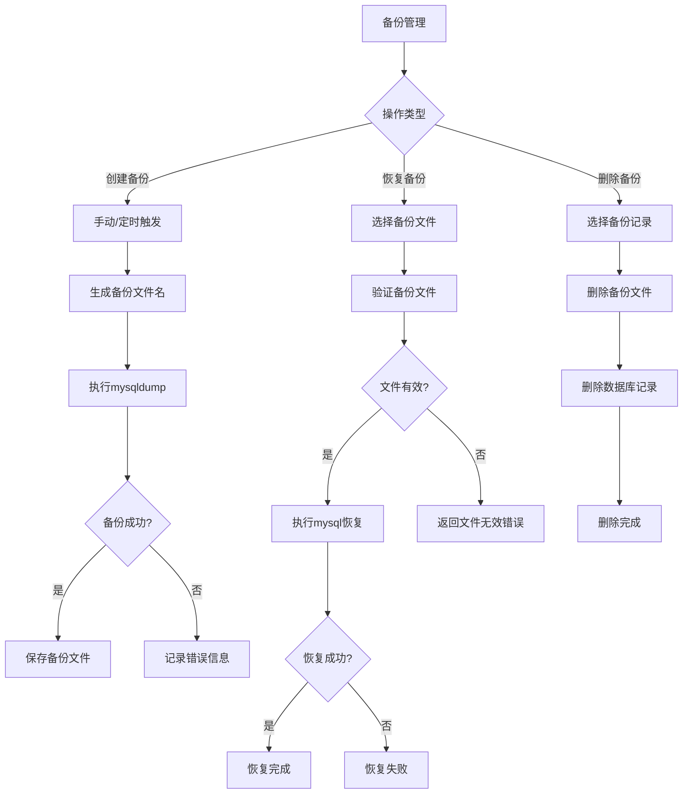
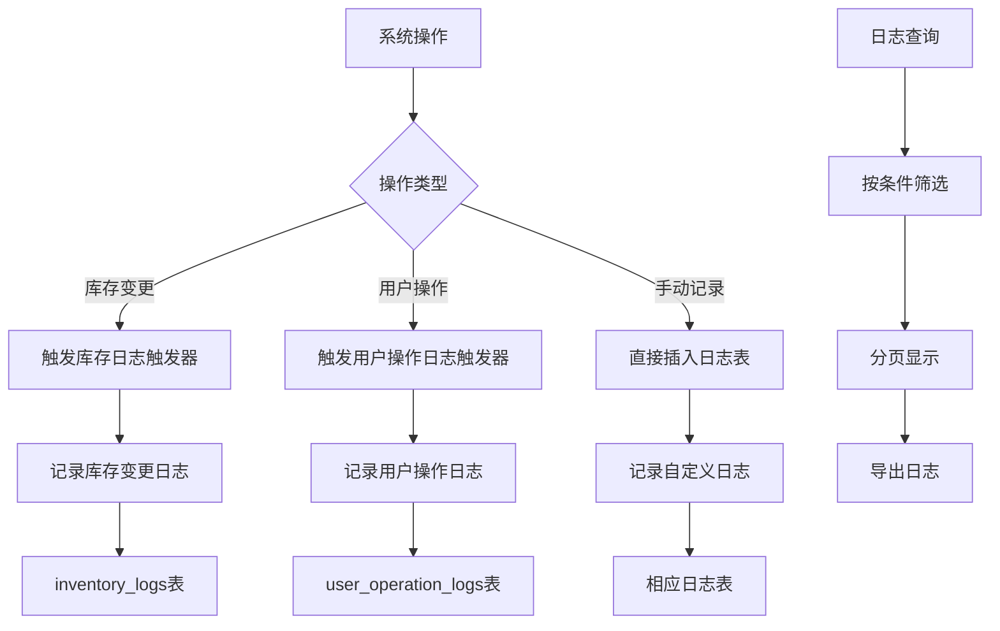

# 数据库功能流程图

## 1. 触发器工作流程

```mermaid
graph TD
    A[用户下单] --> B[插入订单详情表]
    B --> C[触发库存扣减触发器]
    C --> D[自动扣减商品库存]
    D --> E[记录库存变更日志]
    E --> F[更新商品表更新时间]
    
    G[订单取消] --> H[更新订单状态为取消]
    H --> I[触发订单状态更新触发器]
    I --> J[检查状态变更]
    J -->|从非取消变为取消| K[恢复商品库存]
    K --> L[记录库存恢复日志]
    
    M[用户更新信息] --> N[更新用户表]
    N --> O[触发用户操作日志触发器]
    O --> P[记录操作日志]
```

## 2. 视图查询流程

```mermaid
graph TD
    A[管理员查看统计] --> B{选择统计类型}
    B -->|商品销售| C[查询商品销售统计视图]
    B -->|用户订单| D[查询用户订单汇总视图]
    B -->|每日销售| E[查询每日销售统计视图]
    
    C --> F[返回商品销售数据]
    D --> G[返回用户订单数据]
    E --> H[返回每日销售数据]
    
    F --> I[前端展示统计图表]
    G --> I
    H --> I
```

## 3. 数据库备份流程

```mermaid
graph TD
    A[备份触发] --> B[定时任务触发]
    B --> C[调用备份服务]
    C --> D[创建备份记录]
    D --> E[执行mysqldump命令]
    E --> F{备份是否成功}
    
    F -->|成功| G[更新备份状态为成功]
    F -->|失败| H[更新备份状态为失败]
    
    G --> I[保存备份文件]
    H --> J[记录错误信息]
    
    M[恢复备份] --> N[选择备份文件]
    N --> O[执行mysql恢复命令]
    O --> P{恢复是否成功}
    
    P -->|成功| Q[恢复完成]
    P -->|失败| R[恢复失败]
```

## 4. 系统整体架构

```mermaid
graph TB
    subgraph "前端层"
        A[Vue.js前端]
    end
    
    subgraph "应用层"
        B[Spring Boot应用]
        C[API控制器]
        D[业务服务层]
    end
    
    subgraph "数据层"
        E[MyBatis Plus]
        F[MySQL数据库]
    end
    
    subgraph "数据库功能"
        G[触发器]
        H[视图]
        I[存储过程]
        J[备份系统]
    end
    
    subgraph "定时任务"
        K[每日备份]
        L[每周备份]
        M[每月备份]
    end
    
    A --> B
    B --> C
    C --> D
    D --> E
    E --> F
    
    F --> G
    F --> H
    F --> I
    F --> J
    
    K --> J
    L --> J
    M --> J
```

## 5. 库存管理流程

```mermaid
graph TD
    A[商品入库] --> B[更新商品库存]
    B --> C[记录入库日志]
    
    D[用户下单] --> E[检查库存是否充足]
    E -->|库存充足| F[创建订单详情]
    E -->|库存不足| G[返回库存不足错误]
    
    F --> H[触发库存扣减触发器]
    H --> I[自动扣减库存]
    I --> J[记录出库日志]
    
    K[订单取消] --> L[触发库存恢复触发器]
    L --> M[自动恢复库存]
    M --> N[记录恢复日志]
    
    O[管理员查看] --> P[查询库存预警视图]
    P --> Q[显示库存不足商品]
```

## 6. 数据统计流程

```mermaid
graph TD
    A[统计请求] --> B{统计类型}
    
    B -->|商品销售统计| C[查询v_product_sales_stats视图]
    B -->|用户订单汇总| D[查询v_user_order_summary视图]
    B -->|每日销售| E[查询v_daily_sales视图]
    B -->|自定义报表| F[调用sp_sales_report存储过程]
    
    C --> G[返回商品销售数据]
    D --> H[返回用户订单数据]
    E --> I[返回每日销售数据]
    F --> J[返回自定义报表数据]
    
    G --> K[数据聚合处理]
    H --> K
    I --> K
    J --> K
    
    K --> L[生成统计图表]
    L --> M[前端展示]
```

## 7. 备份恢复流程

```mermaid
graph TD
    A[备份管理] --> B{操作类型}
    
    B -->|创建备份| C[手动/定时触发]
    B -->|恢复备份| D[选择备份文件]
    B -->|删除备份| E[选择备份记录]
    
    C --> F[生成备份文件名]
    F --> G[执行mysqldump]
    G --> H{备份成功?}
    H -->|是| I[保存备份文件]
    H -->|否| J[记录错误信息]
    
    D --> K[验证备份文件]
    K --> L{文件有效?}
    L -->|是| M[执行mysql恢复]
    L -->|否| N[返回文件无效错误]
    
    M --> O{恢复成功?}
    O -->|是| P[恢复完成]
    O -->|否| Q[恢复失败]
    
    E --> R[删除备份文件]
    R --> S[删除数据库记录]
    S --> T[删除完成]
```

## 8. 日志管理流程

```mermaid
graph TD
    A[系统操作] --> B{操作类型}
    
    B -->|库存变更| C[触发库存日志触发器]
    B -->|用户操作| D[触发用户操作日志触发器]
    B -->|手动记录| E[直接插入日志表]
    
    C --> F[记录库存变更日志]
    D --> G[记录用户操作日志]
    E --> H[记录自定义日志]
    
    F --> I[inventory_logs表]
    G --> J[user_operation_logs表]
    H --> K[相应日志表]
    
    L[日志查询] --> M[按条件筛选]
    M --> N[分页显示]
    N --> O[导出日志]
```

这些流程图展示了电商管理系统中数据库功能（触发器、视图、备份）的完整工作流程，帮助理解各个功能模块之间的协作关系。
