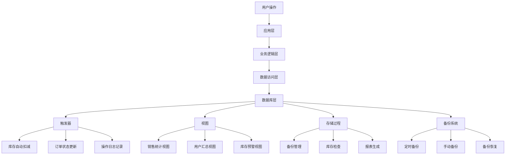

# 电商管理系统数据库功能说明

## 概述

本系统集成了数据库应用技术课程中的核心功能：**触发器**、**视图**和**数据库备份**，为电商管理系统提供了完整的数据管理解决方案。

## 1. 数据库触发器 (Triggers)

### 1.1 库存自动扣减触发器

**触发器名称**: `tr_order_items_after_insert`

**触发时机**: 当订单详情表插入新记录时

**功能说明**:
- 自动扣减商品库存数量
- 记录库存变更日志
- 确保库存数据的一致性

**SQL代码**:
```sql
CREATE TRIGGER tr_order_items_after_insert
AFTER INSERT ON order_items
FOR EACH ROW
BEGIN
    -- 扣减商品库存
    UPDATE products 
    SET stock = stock - NEW.quantity,
        updated_at = CURRENT_TIMESTAMP
    WHERE id = NEW.product_id;
    
    -- 记录库存变更日志
    INSERT INTO inventory_logs (product_id, change_type, quantity, reason, created_at)
    VALUES (NEW.product_id, 'out', NEW.quantity, CONCAT('订单扣减，订单号：', NEW.order_id), CURRENT_TIMESTAMP);
END
```

### 1.2 订单取消库存恢复触发器

**触发器名称**: `tr_orders_after_update`

**触发时机**: 当订单表状态更新时

**功能说明**:
- 订单取消时自动恢复库存
- 记录库存恢复日志
- 防止库存丢失

### 1.3 用户操作日志触发器

**触发器名称**: `tr_users_after_update`

**触发时机**: 当用户信息更新时

**功能说明**:
- 自动记录用户信息变更
- 提供操作审计功能

## 2. 数据库视图 (Views)

### 2.1 商品销售统计视图

**视图名称**: `v_product_sales_stats`

**功能说明**:
- 统计每个商品的销售情况
- 计算总销量、销售额、订单数量
- 提供库存状态预警

**主要字段**:
- `product_id`: 商品ID
- `product_name`: 商品名称
- `total_sold_quantity`: 总销量
- `total_sales_amount`: 总销售额
- `stock_status`: 库存状态

### 2.2 用户订单汇总视图

**视图名称**: `v_user_order_summary`

**功能说明**:
- 统计每个用户的订单情况
- 计算用户消费总额、平均订单金额
- 提供用户行为分析数据

### 2.3 每日销售统计视图

**视图名称**: `v_daily_sales`

**功能说明**:
- 按日期统计销售数据
- 计算每日订单数、客户数、销售额
- 提供销售趋势分析

## 3. 数据库备份功能

### 3.1 备份类型

#### 定时备份
- **每日备份**: 凌晨2点自动执行
- **每周备份**: 周日凌晨3点自动执行
- **每月备份**: 每月1号凌晨4点自动执行

### 3.2 备份功能特性

- **完整备份**: 包含数据、表结构、触发器、存储过程
- **增量备份**: 支持事务一致性
- **压缩存储**: 减少存储空间占用
- **备份验证**: 自动验证备份文件完整性

### 3.3 备份管理

#### API接口
```http
# 恢复备份
POST /api/backup/restore/{backupId}

# 获取备份列表
GET /api/backup/records

# 删除备份
DELETE /api/backup/records/{backupId}
```

#### 脚本备份
```bash
# 执行备份
./scripts/backup_database.sh ecom_management my_backup.sql

# 恢复备份
./scripts/restore_database.sh ecom_management /backups/my_backup.sql
```

## 4. 存储过程 (Stored Procedures)

### 4.1 备份创建存储过程

**过程名称**: `sp_create_backup`

**参数**:
- `backup_name`: 备份名称
- `backup_type`: 备份类型

**功能**: 创建备份记录并生成备份文件路径

### 4.2 销售统计报表存储过程

**过程名称**: `sp_sales_report`

**参数**:
- `start_date`: 开始日期
- `end_date`: 结束日期

**功能**: 生成指定时间范围的销售统计报表

## 5. 日志管理

### 5.1 库存变更日志

**表名**: `inventory_logs`

**记录内容**:
- 商品ID
- 变更类型（入库/出库）
- 变更数量
- 变更原因
- 变更时间

### 5.2 用户操作日志

**表名**: `user_operation_logs`

**记录内容**:
- 用户ID
- 操作类型
- 操作描述
- IP地址
- 用户代理
- 操作时间

## 6. 系统架构图



## 7. 使用示例

### 7.1 查看商品销售统计
```sql
SELECT * FROM v_product_sales_stats 
ORDER BY total_sales_amount DESC 
LIMIT 10;
```

### 7.2 生成销售报表
```sql
CALL sp_sales_report('2024-01-01', '2024-01-31');
```

### 7.3 查看库存变更日志
```sql
SELECT il.*, p.name as product_name 
FROM inventory_logs il
JOIN products p ON il.product_id = p.id
ORDER BY il.created_at DESC
LIMIT 20;
```

## 8. 性能优化建议

1. **索引优化**: 为经常查询的字段添加索引
2. **视图缓存**: 合理使用视图缓存提高查询性能
3. **备份策略**: 根据数据量调整备份频率
4. **日志清理**: 定期清理历史日志数据
5. **监控告警**: 设置数据库性能监控和告警

## 9. 安全考虑

1. **权限控制**: 限制备份和恢复操作的权限
2. **数据加密**: 敏感数据备份时进行加密
3. **访问审计**: 记录所有数据库操作日志
4. **备份验证**: 定期验证备份文件的完整性

## 10. 故障恢复

1. **备份恢复**: 使用最新的完整备份进行恢复
2. **增量恢复**: 结合事务日志进行增量恢复
3. **数据校验**: 恢复后验证数据完整性
4. **服务重启**: 恢复完成后重启相关服务

---

本系统通过集成触发器、视图和备份功能，为电商管理提供了完整的数据管理解决方案，确保了数据的完整性、一致性和可恢复性。
