# 电商订单管理系统 - 实验报告PPT内容

---

## 第1页：封面

### 电商订单管理系统
#### Database Application Project

**项目名称：** 电商订单管理系统（E-commerce Order Management System）

**小组成员：**
- 成员1：[姓名] - 学号：[学号]
- 成员2：[姓名] - 学号：[学号]
- 成员3：[姓名] - 学号：[学号]
- 成员4：[姓名] - 学号：[学号]


---

## 第2页：项目摘要

### 项目概述

本项目是一个基于**Vue 3 + Spring Boot + MySQL**的全栈电商订单管理系统，实现了完整的电商业务流程。

### 核心功能

✅ **用户管理**：角色权限分离（管理员/普通用户），邮箱+密码登录，MD5加密

✅ **商品管理**：5大商品分类，商品CRUD，实时库存管理，分类筛选与搜索

✅ **订单管理**：完整购物流程，订单状态管理，收货信息填写

✅ **购物车管理**：商品增删改查，实时统计，数据持久化

✅ **数据库高级功能**：触发器自动库存扣减/恢复，销量统计视图，数据库备份

✅ **权限控制**：基于角色的访问控制（RBAC），路由守卫，Token身份验证

### 技术特色

🔹 **MyBatis实现** - 避免过度封装，SQL完全可控
🔹 **数据库触发器** - 业务逻辑下沉，保证数据一致性
🔹 **现代化前端** - Vue 3 Composition API + TypeScript + Pinia

---

## 第3页：团队分工

### 开发任务分配

| 成员 | 主要负责模块 | 具体任务 | 工作量占比 |
|------|-------------|---------|-----------|
| **成员1** | **用户登录与注册模块** | • 用户注册前后端实现<br>• 用户登录前后端实现<br>• 密码加密（MD5+Salt）<br>• Token身份验证<br>• 登录页面UI设计 | 20% |
| **成员2** | **商品管理模块** | • 商品管理接口（CRUD）<br>• 管理员商品管理页面<br>• 商品数据校验<br>• 商品状态管理<br>• 商品图片URL管理 | 25% |
| **成员3** | **订单管理模块** | • 订单创建与查询接口<br>• 订单状态管理接口<br>• 管理员订单管理页面<br>• 订单智能搜索功能<br>• 收货信息管理 | 25% |
| **成员4** | **数据库设计 + 购物车 + 搜索** | • 数据库表结构设计（8个表）<br>• 触发器与视图开发<br>• 购物车模块前后端实现<br>• 首页商品分类功能<br>• 商品搜索与筛选功能 | 30% |

### 共同完成任务

- 文档编写
- 功能演示与答辩准备

---

## 第4页：系统架构

### 技术架构图

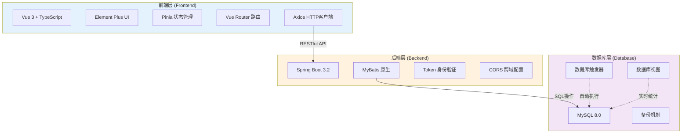

### 三层架构说明

**前端层：** 负责用户交互，数据展示，表单验证

**后端层：** 处理业务逻辑，数据校验，API接口

**数据库层：** 数据持久化，触发器自动化，视图统计

---

## 第5页：数据库设计

### 数据库整体架构

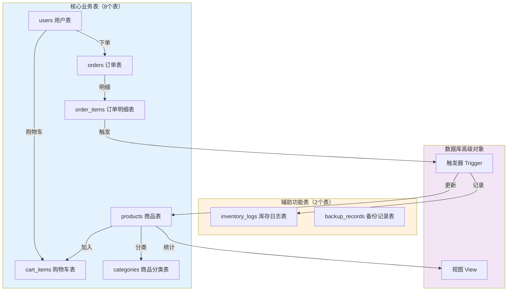

### 数据库设计说明

**1. 核心业务表（6个）**
- `users`：用户信息表（邮箱、密码、角色）
- `products`：商品信息表（名称、价格、库存、分类）
- `orders`：订单主表（订单号、用户、金额、状态、收货信息）
- `order_items`：订单明细表（订单商品、数量、单价）
- `cart_items`：购物车表（用户、商品、数量）
- `categories`：商品分类表（5大分类）

**2. 辅助功能表（2个）**
- `inventory_logs`：库存变更日志表（记录每次库存变化）
- `backup_records`：数据库备份记录表（备份文件信息）

**3. 数据库触发器（1个）**
- `tr_order_items_after_insert`：订单商品插入后触发
  - 自动扣减商品库存
  - 自动记录库存变更日志

**4. 数据库视图（1个）**
- `v_product_sales_stats`：商品销量统计视图
  - 实时统计每个商品的销量、销售额
  - 显示当前库存状态


## 第6页：用户管理功能

### 功能概述

实现了**双角色用户系统**，支持管理员和普通用户两种角色，具有完善的安全机制。

### 核心流程图

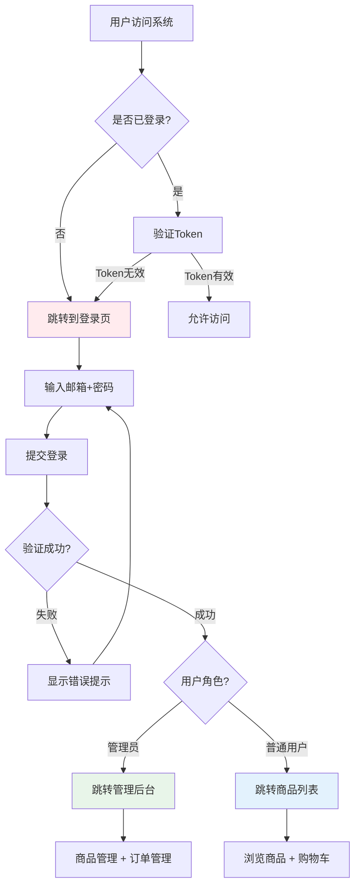

### 安全机制

**1. 密码加密存储**
- 使用MD5 + 随机盐值加密
- 盐值单独存储，提高安全性
- 密码不可逆，防止泄露

**2. Token身份验证**
- 登录成功生成Token
- Token存储在localStorage
- 每次请求携带Token验证

**3. 路由权限控制**
- 前端路由守卫（beforeEach）
- 后端接口权限验证
- 未登录自动跳转登录页

## 第7页：商品管理功能

### 功能概述

实现了**完整的商品生命周期管理**，包括5大分类、商品CRUD、实时库存管理、搜索筛选等功能。

### 商品展示流程

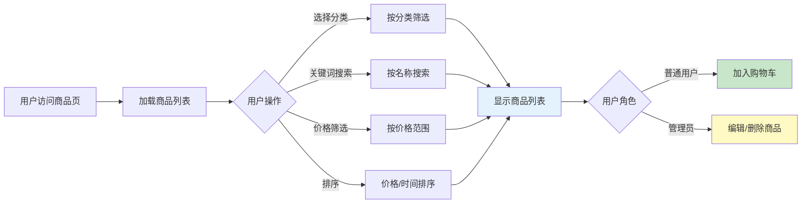

### 5大商品分类

| 分类ID | 分类名称 | 示例商品 |
|--------|---------|---------|
| 1 | 📱 电子产品 | iPhone、MacBook、iPad |
| 2 | 👕 服装鞋帽 | Nike运动鞋、T恤 |
| 3 | 🏠 家居生活 | 空气净化器、扫地机器人 |
| 4 | 📚 图书文具 | Vue.js实战、算法书籍 |
| 5 | ⚽ 运动户外 | 瑜伽垫、篮球 |

### 管理员功能（CRUD）

**截图说明区域：**
- 商品管理页面截图（表格展示）
- 新增商品对话框截图
- 编辑商品表单截图
- 商品图片展示效果

### 搜索筛选功能

**多维度搜索：**
- **关键词搜索**：按商品名称模糊匹配
- **分类筛选**：点击侧边栏快速定位
- **价格筛选**：全部/200元以下/200-500元/500元以上
- **排序功能**：按创建时间/价格升序降序

---

## 第8页：首页商品搜索与分类功能

### 功能概述

实现了**用户端商品展示首页**，包含5大分类侧边栏、关键词搜索、价格筛选、排序功能，提供流畅的购物体验。

### 商品展示页面结构

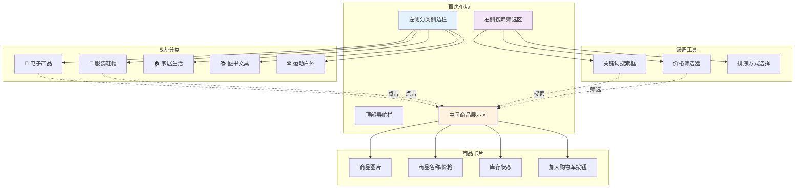

### 搜索与筛选流程

```mermaid
graph LR
    A[用户访问首页] --> B{选择操作}
    
    B -->|点击分类| C[分类筛选]
    B -->|输入关键词| D[关键词搜索]
    B -->|选择价格范围| E[价格筛选]
    B -->|选择排序方式| F[排序]
    
    C --> G[发送API请求<br>categoryId=?]
    D --> H[发送API请求<br>keyword=?]
    E --> I[发送API请求<br>minPrice=? maxPrice=?]
    F --> J[发送API请求<br>sortBy=? sortOrder=?]
    
    G --> K[后端查询数据库]
    H --> K
    I --> K
    J --> K
    
    K --> L[返回商品列表]
    L --> M[前端渲染卡片]
    M --> N[显示商品图片+价格]
    N --> O[用户点击"加入购物车"]
    
    style G fill:#4caf50
    style K fill:#2196f3
    style M fill:#ff9800
```

### 核心功能详解

**1. 分类侧边栏**
- 5大商品分类一目了然
- 点击分类快速筛选
- 支持"全部分类"查看所有商品
- 当前分类高亮显示

**2. 关键词搜索**
- 实时搜索商品名称
- 支持模糊匹配
- 自动去除空格
- 搜索无结果时友好提示

**3. 价格筛选**
- **全部价格**：不限价格范围
- **200元以下**：适合学生党
- **200-500元**：中档商品
- **500元以上**：高端商品

**4. 排序功能**
- **按时间排序**：新品优先/旧品优先
- **按价格排序**：价格从低到高/从高到低
- 默认按创建时间降序

**5. 分页显示**
- 每页显示10个商品
- 底部分页器
- 支持跳转到指定页码
- 显示商品总数

### 商品卡片展示

**卡片包含信息：**
- 📷 商品图片（400x400）
- 📝 商品名称
- 💰 商品价格（红色大字）
- 📦 库存状态（有货/缺货）
- 🛒 "加入购物车"按钮

**截图说明区域：**
- 首页整体布局截图（分类侧边栏 + 商品网格）
- 搜索功能演示截图
- 价格筛选效果截图
- 商品卡片样式截图

### 为什么要做商品搜索与分类功能？

**意义1 - 提升用户体验：**
- 用户可快速找到目标商品
- 避免在海量商品中迷失
- 减少用户操作步骤
- 提高购物效率

**意义2 - 增加转化率：**
- 精准筛选提高购买意愿
- 分类展示激发购物欲望
- 价格筛选降低决策成本
- 排序功能满足不同需求

**意义3 - 数据分析基础：**
- 记录用户搜索关键词
- 分析用户价格偏好
- 了解热门分类
- 指导商品运营

**意义4 - 技术实现优势：**
- 动态SQL拼接，灵活应对多条件查询
- 前端组件化设计，易于维护
- 分页加载，提升性能
- 响应式布局，适配多设备

---

## 第9页：订单管理功能

### 功能概述

实现了**完整的订单生命周期管理**，从用户下单到订单完成，包含5种订单状态和完善的订单查询功能。

### 订单生命周期流程

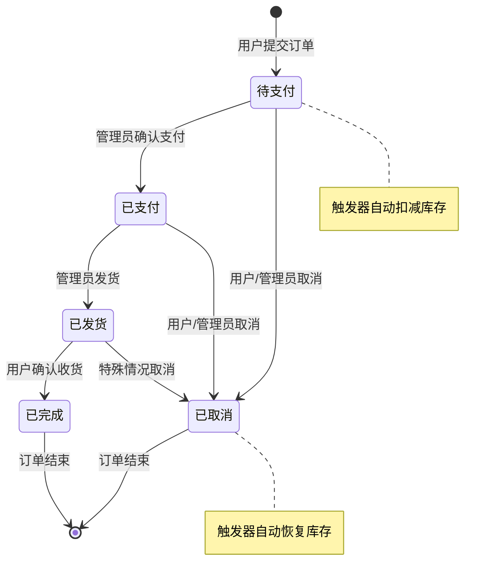

### 订单状态管理

| 状态 | 英文标识 | 说明 | 可操作人 |
|------|---------|------|---------|
| 🟡 待支付 | pending | 订单已创建，等待支付 | 用户/管理员 |
| 🟢 已支付 | paid | 支付完成，等待发货 | 管理员 |
| 🔵 已发货 | shipped | 商品已发出，等待收货 | 管理员 |
| ✅ 已完成 | completed | 订单完成 | - |
| ❌ 已取消 | cancelled | 订单取消，库存恢复 | 用户/管理员 |

### 下单流程详解

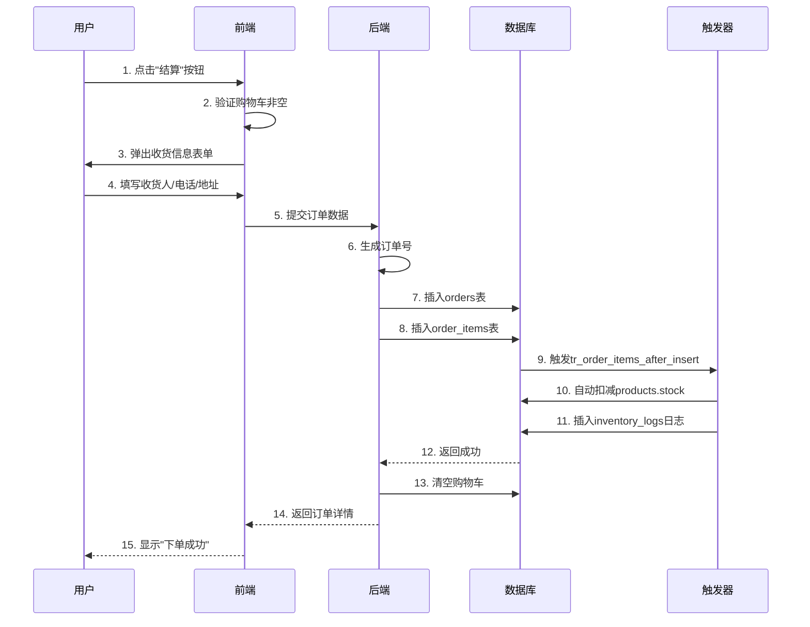

### 收货信息管理

**订单必填字段：**
- 收货人姓名（receiver_name）
- 联系电话（receiver_phone）
- 收货地址（receiver_address）

**截图说明区域：**
- 收货信息填写表单截图
- 订单列表页面截图
- 订单详情展示截图
---

## 第9页：购物车管理功能

### 功能概述

实现了**持久化购物车系统**，支持商品增删改查、实时统计、下单自动清空等功能。

### 购物车操作流程

```mermaid
graph TD
    A[用户浏览商品] --> B[点击"加入购物车"]
    B --> C{商品是否已在购物车?}
    
    C -->|是| D[数量+1]
    C -->|否| E[新增购物车记录]
    
    D --> F[保存到数据库]
    E --> F
    
    F --> G[更新导航栏徽章]
    G --> H[用户查看购物车]
    
    H --> I{用户操作}
    I -->|修改数量| J[更新数据库]
    I -->|删除商品| K[删除记录]
    I -->|结算| L[跳转订单页面]
    
    J --> M[实时计算总价]
    K --> M
    L --> N[下单成功后清空购物车]
    
    style F fill:#c8e6c9
    style M fill:#fff9c4
    style N fill:#ffccbc
```

### 购物车核心功能

**1. 实时统计**
- 导航栏显示商品总数量
- 自动计算小计（单价 × 数量）
- 自动计算总价

**2. 数据持久化**
- 购物车数据保存在数据库
- 用户退出登录后数据不丢失
- 跨设备同步（同一账号）

**3. 商品管理**
- 增加/减少商品数量
- 删除单个商品
- 批量结算

**截图说明区域：**
- 购物车页面截图（商品列表+总价）
- 导航栏购物车徽章截图
- 商品数量调整按钮截图

### 为什么要做购物车持久化？

**意义：** 购物车是用户购物决策的暂存区，持久化保证用户体验连续性。我们实现：
- 用户关闭浏览器后购物车不丢失
- 同一账号可跨设备访问购物车
- 避免因网络中断导致数据丢失
- 提升用户购物满意度

---

## 第10页：数据库触发器（自动化核心）

### 功能概述

通过**数据库触发器**实现业务逻辑自动化，确保库存数据一致性，这是本项目的核心技术亮点。

### 触发器工作原理

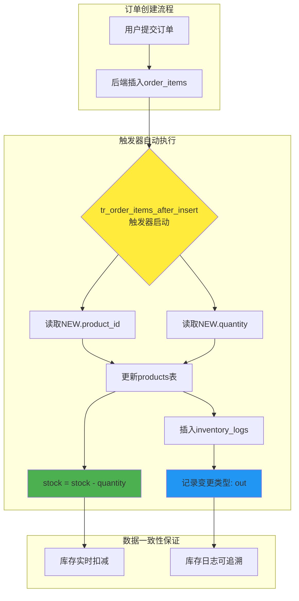

### 触发器SQL逻辑（不展示代码）

**触发器名称：** `tr_order_items_after_insert`

**触发时机：** 在 `order_items` 表插入数据之后

**自动操作：**
1. 读取新插入的商品ID和数量
2. 更新 `products` 表的 `stock` 字段（减少库存）
3. 插入 `inventory_logs` 表记录库存变更

### 库存变更日志表（inventory_logs）

| 字段 | 说明 | 示例值 |
|------|------|--------|
| id | 日志ID | 1 |
| product_id | 商品ID | 5 |
| change_type | 变更类型 | out（出库） |
| quantity | 变更数量 | -2 |
| reason | 变更原因 | 订单ID: 12345 |
| created_at | 记录时间 | 2025-10-22 12:30:00 |

### 截图说明区域：
- 下单前后库存变化对比截图
- inventory_logs表数据截图
- 数据库触发器定义截图（可选）

### 为什么要使用数据库触发器？

**意义1 - 业务逻辑下沉：**
- 库存扣减不依赖应用层代码
- 即使直接操作数据库也能保证一致性
- 降低后端代码复杂度

**意义2 - 数据一致性保证：**
- 订单创建和库存扣减在同一事务中
- 避免因网络延迟导致的数据不一致
- 数据库层面的原子性保证

**意义3 - 性能优化：**
- 减少应用层与数据库的交互次数
- SQL执行效率更高
- 并发场景下更可靠

**意义4 - 审计与追溯：**
- 自动记录所有库存变更
- 便于问题排查
- 支持业务数据分析

---

## 第11页：商品销量统计功能

### 功能概述

通过**数据库视图**实现商品销量统计，管理员可实时查看每个商品的销售数据，辅助经营决策。

### 销量统计视图结构

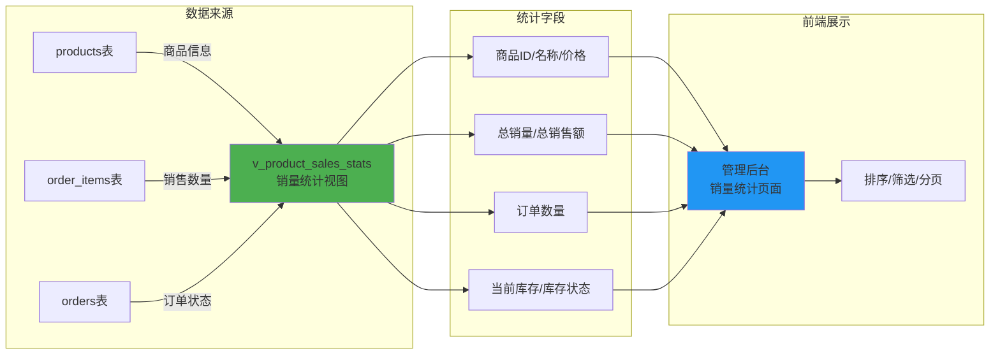

### 视图查询逻辑（不展示代码）

**视图名称：** `v_product_sales_stats`

**统计维度：**
1. **商品基本信息**：ID、名称、当前价格
2. **销售数据**：总销量、总销售额、订单数
3. **库存信息**：当前库存、库存状态
4. **数据过滤**：排除已取消订单

### 库存状态颜色标识

| 库存范围 | 状态 | 颜色标识 |
|---------|------|---------|
| > 50 | 库存充足 | 🟢 绿色 |
| 10 - 50 | 库存紧张 | 🟡 黄色 |
| < 10 | 库存告急 | 🔴 红色 |
| = 0 | 缺货 | ⚫ 灰色 |

### 统计页面展示效果

**截图说明区域：**
- 销量统计表格截图（排序+颜色标识）
- 页面底部汇总数据截图
- 库存预警效果截图

### 为什么要做销量统计功能？

**意义1 - 数据驱动决策：**
- 管理员可基于真实数据调整策略
- 避免盲目补货或促销
- 提升运营效率

**意义2 - 库存优化：**
- 实时掌握库存状态
- 提前预警库存不足
- 减少资金占用

**意义3 - 业务分析：**
- 了解商品销售趋势
- 优化商品结构
- 提升客户满意度

**意义4 - 技术实现优势：**
- 使用视图而非实时计算，提升查询性能
- 复杂SQL封装在视图中，简化应用层代码
- 数据实时更新，无需手动刷新

---

## 第12页：数据库备份功能

### 功能概述

实现**手动数据库备份**功能，管理员可随时创建数据库完整备份，保障数据安全。

### 备份流程

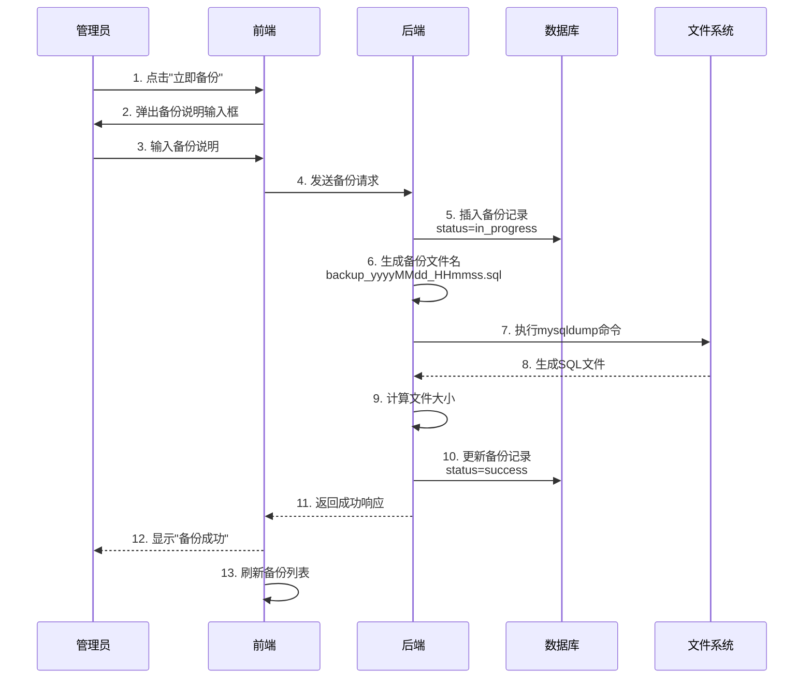

### 备份记录表（backup_records）

| 字段 | 说明 | 示例值 |
|------|------|--------|
| id | 备份ID | 1 |
| backup_file_name | 文件名 | backup_20251022_123045.sql |
| backup_file_path | 文件路径 | database/backups/... |
| backup_file_size | 文件大小 | 2048576（字节）→ 2MB |
| backup_type | 备份类型 | manual（手动） |
| status | 备份状态 | success / failed |
| description | 备份说明 | 版本更新前备份 |
| created_at | 备份时间 | 2025-10-22 12:30:45 |

### 备份管理功能

**1. 创建备份**
- 一键备份整个数据库
- 自动生成带时间戳的文件名
- 记录备份元数据

**2. 查看备份**
- 分页展示备份列表
- 显示文件大小（自动转换KB/MB/GB）
- 状态标识（成功/失败）

**3. 删除备份**
- 删除备份文件
- 删除数据库记录
- 二次确认防止误删

**截图说明区域：**
- 数据库备份管理页面截图
- 创建备份对话框截图
- 备份记录列表截图
- 文件大小展示效果

### 备份文件存储

**存储路径：**
```
项目根目录/
├── database/
│   ├── backups/              ← 备份文件存储目录
│   │   ├── backup_20251022_121830.sql
│   │   ├── backup_20251022_153045.sql
│   │   └── ...
│   ├── init.sql
│   └── create_essential_triggers.sql
```

### 为什么要做数据库备份功能？

**意义1 - 数据安全保障：**
- 防止误操作导致数据丢失
- 系统升级前备份
- 重大操作前备份

**意义2 - 灾难恢复：**
- 硬件故障时快速恢复
- 软件BUG导致数据损坏时回滚
- 降低业务中断风险

**意义3 - 版本管理：**
- 保留不同时间点的数据版本
- 便于问题追溯
- 支持数据审计

**意义4 - 运维便利：**
- 管理员无需手动执行命令
- 可视化备份管理
- 记录备份历史

---

## 第14页：系统流程演示

### 完整购物流程演示

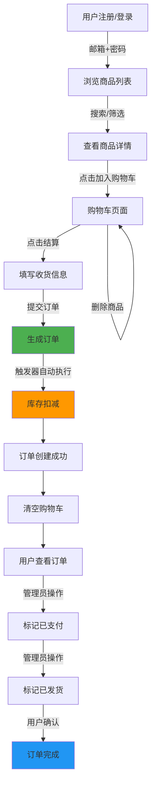

### 管理员运营流程

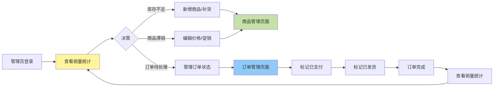

---

## 第15页：开发规范与团队协作

### 团队协作工具

**1. 版本控制**
- Git + Gitee
- 分支管理策略
- 冲突解决流程

**2. 文档管理**
- 需求分析报告
- 接口文档
- 使用指南

**3. 项目管理**
- 任务分工明确
- 进度定期同步
- 问题及时沟通

### 开发环境统一

| 工具 | 版本 |
|------|------|
| Java | 17+ |
| Node.js | 18+ |
| MySQL | 8.0 |
| Maven | 3.8+ |
| npm | 9+ |

**项目仓库：** [Gitee链接]

---


# PPT制作建议

## 配色方案

**主色调：**
- 主色：#2196F3（蓝色）
- 辅色：#4CAF50（绿色）
- 强调色：#FF9800（橙色）
- 背景：#FFFFFF（白色）+ #F5F5F5（浅灰）

## 字体建议

- **标题：** 微软雅黑 Bold（28-36pt）
- **正文：** 微软雅黑（18-24pt）
- **代码/表格：** Consolas 或 Courier New（14-16pt）

## 每页布局

- **页眉：** 项目名称 
- **页脚：** 页码 + 小组成员
- **内容区：** 左右留白、上下留白充足
- **图表：** 居中对齐，添加边框

## 动画建议

- 使用简单的淡入/淡出动画
- 流程图逐步显示
- 避免过度动画影响专业性

## 图表工具

- **流程图：** 使用mermaid在线渲染器生成PNG
- **截图：** 使用Snipaste或系统截图工具
- **表格：** PowerPoint内置表格功能

---

# 文件说明

本文件包含完整的PPT内容，约21页，涵盖：
1. 封面（1页）
2. 摘要（1页）
3. 团队分工（1页）
4. 系统架构（1页）
5. 数据库设计（1页）
6. 用户管理（1页）
7. 商品管理（1页）
8. 首页商品搜索与分类（1页）⭐ 新增
9. 订单管理（1页）
10. 购物车管理（1页）
11. 数据库触发器（1页）
12. 销量统计（1页）
13. 数据库备份（1页）
14. 系统流程演示（1页）
15. 开发规范（1页）


请根据实际情况调整小组成员信息、截图内容，并在PowerPoint中进行美化排版。

