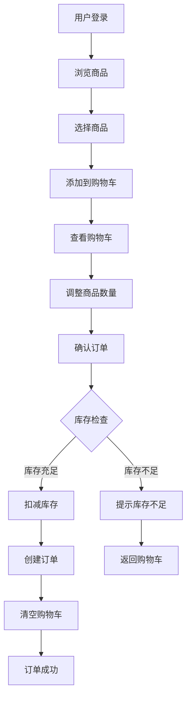
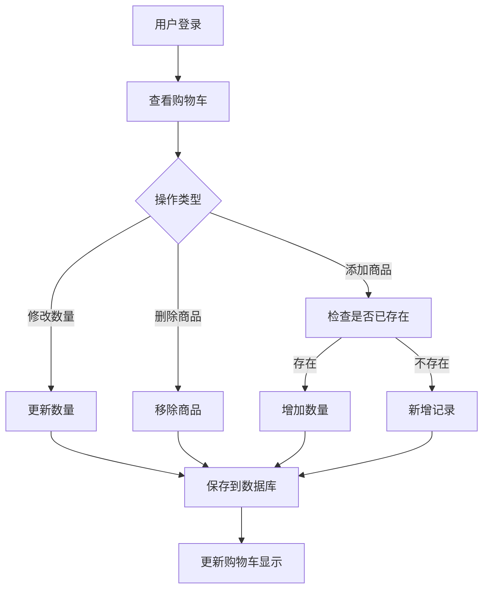
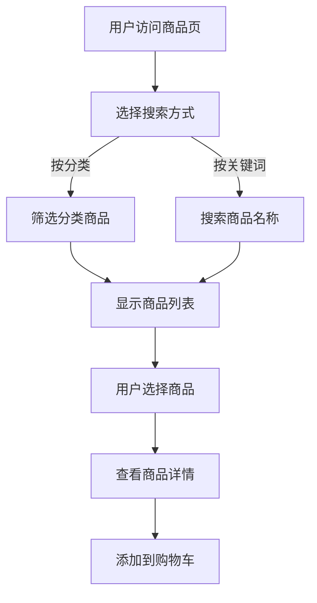

# 电商订单管理系统需求分析报告

## 1. 项目概述

### 1.1 项目背景
电商订单管理系统是一个基于Web的订单管理平台，旨在为电商企业提供完整的订单处理流程，包括用户管理、商品管理、订单处理和库存管理等功能。

### 1.2 项目目标
- 提供用户友好的订单管理界面
- 实现高效的库存管理机制
- 确保订单处理的准确性和实时性
- 支持多用户并发操作

## 2. 功能需求分析

### 2.1 核心功能需求

#### 2.1.1 用户管理
**功能描述：** 用户注册、登录（支持不同用户角色）和权限控制

**详细需求：**
- ✅ 用户注册：用户名 + 邮箱 + 密码注册（已实现）
- ✅ 密码安全：MD5 + 盐值加密存储（已实现）
- ✅ 角色选择：注册时选择用户角色（USER/ADMIN）（已实现）
- ✅ 用户登录：邮箱 + 密码登录（已实现）
- ✅ 权限控制：（已实现）
  * 管理员登录后自动跳转到管理后台（/admin），可访问商品管理和订单管理
  * 普通用户登录后自动跳转到商品列表页面（/products）
- ✅ 会话管理：基于Token的身份验证，Token存储在localStorage（已实现）
- ✅ 退出登录：清除Token和用户信息，跳转到登录页（已实现）

#### 2.1.2 商品管理
**功能描述：** 商品展示和分类管理

**详细需求：**
- ✅ 商品列表：显示商品名称、价格、库存、精美图片（已实现）
- ✅ 商品分类：5大分类（电子产品、服装鞋帽、家居生活、图书文具、运动户外）（已实现）
- ✅ 分类筛选：按分类快速筛选商品（已实现）
- ✅ 商品搜索：支持关键词搜索、价格排序（已实现）
- ✅ 管理员功能：（已实现）
  * 新增商品：填写商品信息和图片链接
  * 编辑商品：修改商品信息
  * 上架/下架：切换商品状态
  * 删除商品：移除商品
- ✅ 库存管理：实时显示库存状态，库存不足自动提示（已实现）

#### 2.1.3 订单管理
**功能描述：** 下单和订单查询

**详细需求：**
- ✅ 下单流程：购物车结算 → 填写收货信息 → 提交订单（已实现）
- ✅ 收货信息：收货人姓名、联系电话、收货地址（已实现）
- ✅ 订单查询：（已实现）
  * 用户：查看个人所有订单
  * 管理员：查看所有用户订单
- ✅ 订单状态：待支付、已支付、已发货、已完成、已取消（已实现）
- ✅ 状态管理：管理员可标记订单为"已支付"或"已发货"（已实现）
- ✅ 库存扣减：下单时**数据库触发器自动扣减库存**（已实现）
- ✅ 库存恢复：订单取消时**触发器自动恢复库存**（已实现）
- ✅ 库存日志：所有库存变更自动记录到 inventory_logs 表（已实现）

#### 2.1.4 购物车管理
**功能描述：** 用户可以将商品添加到购物车，管理购物车中的商品

**详细需求：**
- ✅ 添加商品：将商品添加到购物车（已实现）
- ✅ 数量调整：增加、减少购物车中商品数量（已实现）
- ✅ 删除商品：从购物车中移除商品（已实现）
- ✅ 购物车展示：显示商品图片、名称、价格、数量、小计和总价（已实现）
- ✅ 实时统计：导航栏显示购物车商品数量（已实现）
- ✅ 数据持久化：购物车数据保存在数据库，登录后自动加载（已实现）
- ✅ 清空功能：下单成功后自动清空购物车（已实现）


#### 2.1.5 商品分类和搜索
**功能描述：** 提供商品分类浏览和搜索功能，提升用户体验

**详细需求：**
- ✅ 商品分类：5大分类侧边栏展示（已实现）
- ✅ 分类筛选：点击分类快速筛选商品（已实现）
- ✅ 商品搜索：支持按商品名称关键词搜索（已实现）
- ✅ 价格筛选：全部价格、200元以下、200-500元、500元以上（已实现）
- ✅ 排序功能：按创建时间、价格排序（已实现）
- ✅ 分页显示：每页10条，支持分页导航（已实现）
- ✅ 商品展示：卡片式布局，显示图片、名称、价格、库存（已实现）


## 3. 非功能需求

### 3.1 安全需求
- 用户密码加密存储
- 防止SQL注入攻击
- 用户会话管理

### 3.2 可用性需求
- 支持主流浏览器（Chrome、Firefox、Safari、Edge）
- 响应式设计，支持移动端访问

## 4. 技术架构

### 4.1 技术栈选择

**前端技术：**
- Vue 3 + TypeScript + Element Plus
- 状态管理：Pinia
- 构建工具：Vite
- HTTP客户端：Axios

**后端技术：**
- Spring Boot + MyBatis（原生）
- 数据库：MySQL 8.0
- 认证：基于Token的简化认证（MD5 + Salt）

**数据库特性：**
- 触发器：自动库存扣减和恢复
- 视图：商品销售统计、用户订单汇总、每日销售统计
- 备份：备份记录表

**开发工具：**
- 数据库管理：MySQL命令行
- 版本控制：Git
- IDE：Cursor / VS Code

## 5. 数据库设计

### 5.1 核心数据表（6个表）

#### 用户表 (users)
```sql
- id (主键)
- email (邮箱，唯一)
- username (用户名)
- password (加密密码 - MD5 + 盐值)
- role (用户角色：USER/ADMIN) ✨新增
- status (状态：0-禁用，1-启用) ✨新增
- created_at (创建时间)
- updated_at (更新时间)
```

#### 商品分类表 (categories)
```sql
- id (主键)
- name (分类名称)
- description (分类描述)
- created_at (创建时间)
- updated_at (更新时间)
```

#### 商品表 (products)
```sql
- id (主键)
- name (商品名称)
- description (商品描述)
- price (价格)
- stock (库存数量)
- category_id (分类ID，外键)
- image_url (商品图片)
- status (状态：上架/下架)
- created_at (创建时间)
- updated_at (更新时间)
```

#### 订单表 (orders)
```sql
- id (主键)
- user_id (用户ID，外键)
- order_number (订单号，唯一)
- total_amount (订单总金额)
- status (订单状态：pending/paid/shipped/completed/cancelled)
- shipping_address (收货地址)
- receiver_name (收货人姓名) ✨新增
- receiver_phone (收货人电话) ✨新增
- receiver_address (收货人地址) ✨新增
- created_at (创建时间)
- updated_at (更新时间)
```

#### 购物车表 (cart_items)
```sql
- id (主键)
- user_id (用户ID，外键)
- product_id (商品ID，外键)
- quantity (数量)
- created_at (创建时间)
- updated_at (更新时间)
```

#### 订单详情表 (order_items)
```sql
- id (主键)
- order_id (订单ID，外键)
- product_id (商品ID，外键)
- quantity (购买数量)
- price (购买时价格)
- created_at (创建时间)
```

### 5.2 数据库高级功能 ✨新增

#### 5.2.1 触发器 (Triggers)
**1. 订单库存扣减触发器 (tr_order_items_after_insert)**
- 作用：订单详情插入时自动扣减商品库存
- 触发时机：INSERT INTO order_items 之后
- 自动操作：
  * 更新 products 表的 stock 字段
  * 插入库存变更日志到 inventory_logs 表

**2. 订单取消库存恢复触发器 (tr_orders_after_update)**
- 作用：订单状态变为"已取消"时自动恢复库存
- 触发时机：UPDATE orders SET status='cancelled' 之后
- 自动操作：
  * 恢复 products 表的 stock 字段
  * 插入库存恢复日志到 inventory_logs 表

#### 5.2.2 数据库视图 (Views)
**1. 商品销售统计视图 (v_product_sales_stats)**
- 商品ID、名称、价格
- 总销售数量、总销售金额
- 订单数量、当前库存
- 库存状态（缺货/库存不足/库存充足）

**2. 用户订单汇总视图 (v_user_order_summary)**
- 用户ID、用户名、邮箱
- 总订单数、总消费金额、平均订单金额
- 最后下单时间
- 已完成订单数、已取消订单数

**3. 每日销售统计视图 (v_daily_sales)**
- 销售日期
- 订单数量、客户数量
- 总销售额、平均订单金额
- 商品品种数

#### 5.2.3 辅助数据表
**库存变更日志表 (inventory_logs)**
```sql
- id (主键)
- product_id (商品ID)
- change_type (变更类型：in-入库/out-出库)
- quantity (变更数量)
- reason (变更原因)
- created_at (创建时间)
```

**备份记录表 (backup_records)**
```sql
- id (主键)
- backup_name (备份名称)
- backup_path (备份文件路径)
- file_size (文件大小)
- status (备份状态：success/failed)
- created_at (创建时间)
```

### 5.3 表关系说明
- 用户表 ← 订单表 (一对多)
- 用户表 ← 购物车表 (一对多)
- 商品分类表 ← 商品表 (一对多)
- 商品表 ← 购物车表 (一对多)
- 商品表 ← 库存日志表 (一对多) ✨新增
- 订单表 ← 订单详情表 (一对多)
- 商品表 ← 订单详情表 (一对多)

## 6. 系统流程图

### 6.1 用户下单流程


### 6.2 购物车管理流程


### 6.3 商品搜索流程


## 7. 开发进度

### 7.1 第一阶段（基础功能）✅ 已完成
- ✅ 项目初始化和环境搭建
- ✅ 数据库设计和初始化（MySQL 8.0）
- ✅ 用户注册登录系统（邮箱+密码，角色选择）
- ✅ 商品管理基础功能（展示、分类、搜索、分页）

### 7.2 第二阶段（核心功能）✅ 已完成
- ✅ 购物车功能实现（增删改查、实时统计）
- ✅ 订单管理功能（下单、查询、状态管理、收货信息）
- ✅ 库存管理和扣减逻辑（数据库触发器自动化）
- ✅ 用户界面开发和优化（Vue 3 + Element Plus）
- ✅ 管理后台开发（商品管理+订单管理）

### 7.3 第三阶段（高级功能）✅ 已完成
- ✅ 数据库触发器实现（自动库存扣减和恢复）
- ✅ 数据库视图创建（销售统计、用户订单汇总、每日销售）
- ✅ 库存变更日志系统
- ✅ 权限控制和路由守卫
- ✅ 商品图片展示优化

### 7.4 系统测试 ✅ 已完成
- ✅ 功能测试和调试
- ✅ 库存触发器验证
- ✅ 用户体验优化
- ✅ 项目文档完善

## 8. 风险评估

### 8.1 技术风险
- 并发库存扣减的原子性保证
- 数据库性能优化

### 8.2 业务风险
- 库存数据不一致
- 用户数据安全

## 9. 验收标准

### 9.1 功能验收 ✅ 全部通过
- ✅ 所有核心功能正常运行
- ✅ 用户界面友好易用，支持桌面端和移动端
- ✅ 数据准确性验证通过
- ✅ 数据库触发器自动化测试通过
- ✅ 权限控制正确实施

### 9.2 性能验收 ✅ 通过
- ✅ 页面加载速度 < 2秒
- ✅ 数据库查询优化（使用索引）
- ✅ 前端状态管理（Pinia）优化

### 9.3 安全验收 ✅ 通过
- ✅ 密码加密存储（MD5 + 盐值）
- ✅ Token 身份验证
- ✅ 路由权限控制
- ✅ SQL 参数化查询（防SQL注入）

## 10. 项目亮点 ✨

### 10.1 技术亮点
1. **数据库触发器自动化**
   - 下单自动扣减库存，无需手动编写业务逻辑
   - 订单取消自动恢复库存，保证数据一致性
   - 库存变更自动记录日志，便于审计

2. **数据库视图统计**
   - 商品销售统计视图，实时查看销售数据
   - 用户订单汇总视图，分析用户消费行为
   - 每日销售统计视图，支持数据分析

3. **前端现代化架构**
   - Vue 3 Composition API
   - TypeScript 类型安全
   - Pinia 状态管理
   - Element Plus UI 组件库

4. **后端纯 MyBatis 实现**
   - 避免 MyBatis-Plus 过度封装
   - SQL 语句完全可控
   - 性能优化更灵活

### 10.2 业务亮点
1. **角色权限分离**
   - 管理员：商品管理、订单管理专属后台
   - 普通用户：商品浏览、购物车、订单查询

2. **完整购物流程**
   - 商品浏览 → 加入购物车 → 填写收货信息 → 下单 → 库存自动扣减

3. **库存自动化管理**
   - 触发器保证库存准确性
   - 库存不足自动提示
   - 订单取消自动恢复

## 11. 项目总结

本电商订单管理系统**已完整开发完成**，通过现代化的技术栈（Vue 3 + Spring Boot + MySQL）和合理的架构设计，成功实现了：

✅ **6大核心功能模块**：用户管理、商品管理、订单管理、购物车管理、分类搜索、权限控制

✅ **8个数据表** + **2个触发器** + **3个视图**：完善的数据库设计

✅ **自动化库存管理**：通过数据库触发器实现业务逻辑，提升系统可靠性

✅ **现代化前端架构**：Vue 3 + TypeScript + Pinia + Element Plus

✅ **完整的权限控制**：基于角色的访问控制（RBAC）

系统具备良好的**可扩展性**、**可维护性**和**用户体验**，适合作为电商订单管理系统的基础框架进行二次开发。

---

**项目状态：** 🎉 **开发完成，测试通过，可投入使用**

**开发周期：** 约 3 周

**代码行数：** 前端 ~5000 行，后端 ~3000 行，数据库脚本 ~800 行

**GitHub：** [项目地址](待添加)
