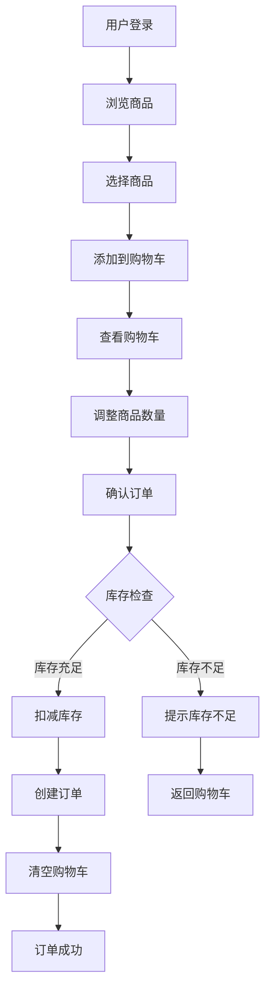
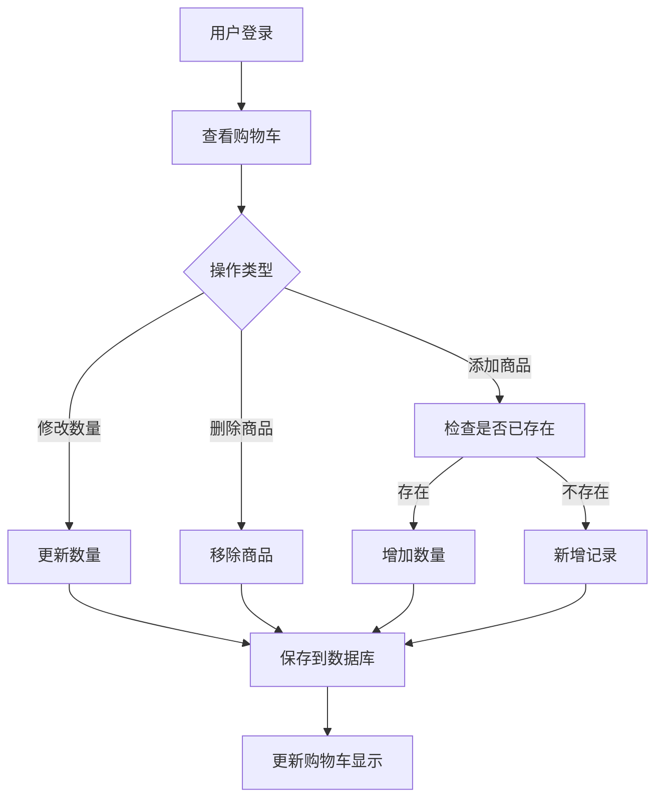
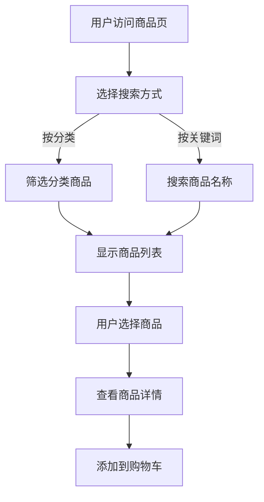

# 电商订单管理系统需求分析报告

## 1. 项目概述

### 1.1 项目背景
电商订单管理系统是一个基于Web的订单管理平台，旨在为电商企业提供完整的订单处理流程，包括用户管理、商品管理、订单处理和库存管理等功能。

### 1.2 项目目标
- 提供用户友好的订单管理界面
- 实现高效的库存管理机制
- 确保订单处理的准确性和实时性
- 支持多用户并发操作

## 2. 功能需求分析

### 2.1 核心功能需求

#### 2.1.1 用户管理
**功能描述：** 用户注册、登录和个人信息管理

**详细需求：**
- 用户注册：邮箱注册，密码验证
- 用户登录：邮箱+密码登录，记住登录状态
- 个人信息：查看和修改个人资料

#### 2.1.2 商品管理
**功能描述：** 商品展示和分类管理

**详细需求：**
- 商品列表：显示商品名称、价格、库存、图片
- 商品分类：按分类筛选商品
- 商品详情：查看商品详细信息
- 库存管理：实时显示库存状态

#### 2.1.3 订单管理
**功能描述：** 下单和订单查询

**详细需求：**
- 下单流程：从购物车确认商品、填写收货地址、提交订单
- 订单查询：查看个人所有订单
- 订单状态：待付款、已付款、已发货、已完成、已取消
- 库存扣减：下单时自动扣减库存，库存不足时提示用户

#### 2.1.4 购物车管理
**功能描述：** 用户可以将商品添加到购物车，管理购物车中的商品

**详细需求：**
- 添加商品：将商品添加到购物车
- 数量调整：增加、减少购物车中商品数量
- 删除商品：从购物车中移除商品
- 购物车展示：显示购物车中所有商品和总价
- 数据持久化：登录用户的购物车数据保存


#### 2.1.5 商品分类和搜索
**功能描述：** 提供商品分类浏览和搜索功能，提升用户体验

**详细需求：**
- 商品分类：展示商品分类列表（如：电子产品、服装、家居等）
- 分类筛选：按分类筛选显示商品
- 商品搜索：支持按商品名称搜索
- 商品详情：点击商品查看详细信息
- 搜索结果：显示搜索结果和数量


## 3. 非功能需求

### 3.1 安全需求
- 用户密码加密存储
- 防止SQL注入攻击
- 用户会话管理

### 3.2 可用性需求
- 支持主流浏览器（Chrome、Firefox、Safari、Edge）
- 响应式设计，支持移动端访问

## 4. 技术架构

### 4.1 技术栈选择

**前端技术：**
- Vue 3 + TypeScript + Element Plus
- 状态管理：Pinia
- 构建工具：Vite

**后端技术：**
- Spring Boot + MyBatis-Plus
- 数据库：MySQL
- 认证：Spring Security + JWT

**开发工具：**
- 数据库管理：MySQL Workbench
- API文档：Swagger
- 版本控制：Git

## 5. 数据库设计

### 5.1 核心数据表（6个表）

#### 用户表 (users)
```sql
- id (主键)
- email (邮箱，唯一)
- phone (手机号，唯一)
- password (加密密码)
- username (用户名)
- created_at (创建时间)
- updated_at (更新时间)
```

#### 商品分类表 (categories)
```sql
- id (主键)
- name (分类名称)
- description (分类描述)
- created_at (创建时间)
- updated_at (更新时间)
```

#### 商品表 (products)
```sql
- id (主键)
- name (商品名称)
- description (商品描述)
- price (价格)
- stock (库存数量)
- category_id (分类ID，外键)
- image_url (商品图片)
- status (状态：上架/下架)
- created_at (创建时间)
- updated_at (更新时间)
```

#### 订单表 (orders)
```sql
- id (主键)
- user_id (用户ID，外键)
- order_number (订单号，唯一)
- total_amount (订单总金额)
- status (订单状态：待付款、已付款、已发货、已完成、已取消)
- shipping_address (收货地址)
- created_at (创建时间)
- updated_at (更新时间)
```

#### 购物车表 (cart_items)
```sql
- id (主键)
- user_id (用户ID，外键)
- product_id (商品ID，外键)
- quantity (数量)
- created_at (创建时间)
- updated_at (更新时间)
```

#### 订单详情表 (order_items)
```sql
- id (主键)
- order_id (订单ID，外键)
- product_id (商品ID，外键)
- quantity (购买数量)
- price (购买时价格)
- created_at (创建时间)
```

### 5.2 表关系说明
- 用户表 ← 订单表 (一对多)
- 用户表 ← 购物车表 (一对多)
- 商品分类表 ← 商品表 (一对多)
- 商品表 ← 购物车表 (一对多)
- 订单表 ← 订单详情表 (一对多)
- 商品表 ← 订单详情表 (一对多)

## 6. 系统流程图

### 6.1 用户下单流程


### 6.2 购物车管理流程


### 6.3 商品搜索流程


## 7. 开发计划

### 7.1 第一阶段（基础功能）- 3周
- 项目初始化和环境搭建
- 数据库设计和初始化
- 用户注册登录系统
- 商品管理基础功能（展示、分类、搜索）

### 7.2 第二阶段（核心功能）- 4周
- 购物车功能实现
- 订单管理功能（下单、查询、状态管理）
- 库存管理和扣减逻辑
- 用户界面开发和优化

### 7.3 第三阶段（测试完善）- 2周
- 功能测试和调试
- 用户体验优化
- 安全加固
- 系统部署和文档完善

## 8. 风险评估

### 8.1 技术风险
- 并发库存扣减的原子性保证
- 数据库性能优化

### 8.2 业务风险
- 库存数据不一致
- 用户数据安全

## 9. 验收标准

### 9.1 功能验收
- 所有核心功能正常运行
- 用户界面友好易用
- 数据准确性验证通过


## 10. 总结

本电商订单管理系统将提供完整的订单管理解决方案，通过现代化的技术栈和合理的架构设计，确保系统的可扩展性、可维护性和用户体验。系统将分阶段开发，确保每个阶段都有可交付的成果，降低项目风险。
